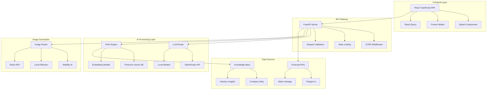

# 🪄 MAGIC POST - Generador Inteligente de Contenido con IA

<div align="center">


[](https://python.org)
[](https://fastapi.tiangolo.com)
[](https://reactjs.org)
[](https://typescriptlang.org)

[](https://langchain.com)
[](https://pinecone.io)
[](https://stability.ai)
[](https://openrouter.ai)

---

### 🚀 **Plataforma de próxima generación para la creación automatizada de contenido empresarial**

*Transforme ideas en contenido viral con IA avanzada, búsqueda semántica y generación de imágenes ultra-realistas*

</div>

---

## 📋 Tabla de Contenidos

- [🎯 Características Principales](#-características-principales)
- [🏗️ Arquitectura del Sistema](#️-arquitectura-del-sistema)
- [🛠️ Stack Tecnológico](#️-stack-tecnológico)
- [⚙️ Instalación y Configuración](#️-instalación-y-configuración)
- [🚀 Guía de Inicio Rápido](#-guía-de-inicio-rápido)
- [📖 Documentación de API](#-documentación-de-api)
- [🎨 Módulos de Generación](#-módulos-de-generación)
- [🔧 Configuración Avanzada](#-configuración-avanzada)
- [🐛 Solución de Problemas](#-solución-de-problemas)
- [📊 Monitoreo y Performance](#-monitoreo-y-performance)
- [🤝 Contribución](#-contribución)

---

## 🎯 Características Principales

### 🧠 **Motor de IA Híbrido**
- **Múltiples LLMs**: LLaMA 3, Mistral 7B, GPT-4, Claude Sonnet
- **RAG Avanzado**: Búsqueda semántica con Pinecone Vector Database
- **Context Injection**: Integración de datos empresariales específicos
- **Fine-tuning dinámico**: Adaptación automática por industria

### 🎨 **Generación de Imágenes Multi-Modal**
- **Stability AI**: Stable Diffusion XL para imágenes ultra-realistas
- **Modelos Locales**: Diffusers con optimización GPU
- **Stock Images**: Unsplash y Pexels con búsqueda inteligente
- **Prompt Engineering**: Traducción automática y optimización de prompts

### 📊 **Análisis Financiero Inteligente**
- **Market Intelligence**: Integración con Polygon.io y Alpha Vantage
- **Sentiment Analysis**: GROQ-powered sentiment de noticias financieras
- **Real-time Data**: Feeds en tiempo real de mercados globales
- **Risk Assessment**: Análisis automático de volatilidad y tendencias

### 🌐 **Optimización Multi-Plataforma**
- **Social Networks**: Twitter, Instagram, LinkedIn, TikTok, Facebook
- **Content Types**: Posts, Stories, Carousels, Videos, Blogs
- **SEO Optimization**: Meta tags, keywords, estructuras optimizadas
- **A/B Testing**: Variantes automáticas para testing

### 🌍 **Soporte Multilingüe Avanzado**
- **4 Idiomas**: Español, Inglés, Francés, Italiano
- **Detección Automática**: Reconocimiento de idioma input
- **Traducción Contextual**: Preservación de tono y estilo
- **Localización Cultural**: Adaptación por mercados regionales

---

## 🏗️ Arquitectura del Sistema



### 🔄 **Flujo de Procesamiento**

1. **Input Processing**: Análisis y validación de solicitudes
2. **Context Retrieval**: Búsqueda semántica en base de conocimientos
3. **AI Generation**: Generación con modelos optimizados
4. **Multi-modal Enhancement**: Adición de elementos visuales
5. **Platform Optimization**: Adaptación a formato específico
6. **Quality Assurance**: Validación y scoring de contenido

---

## 🛠️ Stack Tecnológico

### 🖥️ **Backend (Python)**

| Componente | Tecnología | Versión | Propósito |
|------------|------------|---------|-----------|
| **Framework** | FastAPI | 0.104+ | API REST ultra-rápida |
| **AI/ML** | LangChain | 0.1.0+ | Orquestación de LLMs |
| **Vector DB** | Pinecone | 3.0+ | Búsqueda semántica |
| **Embeddings** | HuggingFace | Latest | Modelos de embedding |
| **Image Gen** | Diffusers | 0.24+ | Generación local de imágenes |
| **HTTP Client** | httpx | 0.25+ | Requests asíncronos |
| **Environment** | python-dotenv | 1.0+ | Gestión de configuración |
| **Database** | Supabase | Latest | Base de datos PostgreSQL |

### 🌐 **Frontend (React/TypeScript)**

| Componente | Tecnología | Versión | Propósito |
|------------|------------|---------|-----------|
| **Framework** | React | 18.2+ | UI Components |
| **Language** | TypeScript | 5.0+ | Type Safety |
| **Styling** | Styled Components | 6.0+ | CSS-in-JS |
| **Animation** | Framer Motion | 10.0+ | Micro-interactions |
| **State** | React Query | 5.0+ | Server State Management |
| **HTTP** | Axios | 1.6+ | API Communication |
| **Build** | Vite | 5.0+ | Ultra-fast bundling |
| **Testing** | Vitest | 1.0+ | Unit & Integration tests |

### 🤖 **Servicios de IA**

| Servicio | Proveedor | Modelo | Uso |
|----------|-----------|--------|-----|
| **Text Generation** | OpenRouter | LLaMA 3, Mistral, GPT-4 | Generación de contenido |
| **Image Generation** | Stability AI | SDXL 1.0 | Imágenes ultra-realistas |
| **Embeddings** | HuggingFace | sentence-transformers | Vector embeddings |
| **Financial Data** | Polygon.io | REST API | Datos de mercado |
| **Sentiment** | GROQ | LLaMA 3 8B | Análisis de sentimientos |

---

## ⚙️ Instalación y Configuración

### 📋 **Prerequisitos del Sistema**

```bash
# Verificar versiones requeridas
python --version   # Python 3.9+
node --version     # Node.js 18+
npm --version      # npm 9+
git --version      # Git 2.30+
```

### 🔐 **Variables de Entorno**

Crea un archivo `.env` en la raíz del proyecto:

```env
# =============================================================================
# MAGIC POST - Configuración de Producción
# =============================================================================

# ┌─────────────────────────────────────────────────────────────────────────┐
# │ CORE AI SERVICES                                                        │
# └─────────────────────────────────────────────────────────────────────────┘

# OpenRouter - Gateway para múltiples LLMs
OPENROUTER_API_KEY=sk-or-v1-your_key_here
MODEL_ID=meta-llama/llama-3-8b-instruct

# Pinecone - Vector Database para RAG
PINECONE_API_KEY=your_pinecone_key_here
PINECONE_ENV=us-east-1
PINECONE_INDEX_NAME=magic-post-knowledge

# ┌─────────────────────────────────────────────────────────────────────────┐
# │ IMAGE GENERATION                                                        │
# └─────────────────────────────────────────────────────────────────────────┘

# Stability AI - Imagen ultra-realista
STABILITY_API_KEY=sk-your_stability_key_here
STABILITY_ENGINE=stable-diffusion-xl-1024-v1-0
STABILITY_HOST=https://api.stability.ai/

# Stock Images
UNSPLASH_ACCESS_KEY=your_unsplash_key_here
PEXELS_API_KEY=your_pexels_key_here

# ┌─────────────────────────────────────────────────────────────────────────┐
# │ FINANCIAL DATA                                                          │
# └─────────────────────────────────────────────────────────────────────────┘

# Market Data
POLYGON_API_KEY=your_polygon_key_here
ALPHA_VANTAGE_KEY=your_alpha_vantage_key_here
GROQ_API_KEY=your_groq_key_here

# ┌─────────────────────────────────────────────────────────────────────────┐
# │ DATABASE                                                                │
# └─────────────────────────────────────────────────────────────────────────┘

# Supabase
SUPABASE_URL=https://your-project.supabase.co
SUPABASE_KEY=your_supabase_anon_key_here
DB_PASSWORD=your_secure_password

# ┌─────────────────────────────────────────────────────────────────────────┐
# │ DEFAULT IMAGE CONFIGURATION                                             │
# └─────────────────────────────────────────────────────────────────────────┘

IMG_SUBJECT=Professional business team in modern office
IMG_STYLE=Modern and sleek
IMG_MEDIUM=Digital art
IMG_LIGHTING=Soft morning light
IMG_COLOR_PALETTE=Corporate blues and whites
IMG_COMPOSITION=Rule of thirds
IMG_RESOLUTION=1024x1024
IMG_CONTRAST=High contrast
IMG_MOOD=Professional and inspiring
IMG_DETAILS=Sharp focus with soft background blur

# ┌─────────────────────────────────────────────────────────────────────────┐
# │ DEVELOPMENT SETTINGS                                                    │
# └─────────────────────────────────────────────────────────────────────────┘

DEBUG=true
LOG_LEVEL=INFO
API_VERSION=v1
CORS_ORIGINS=http://localhost:3000,http://localhost:3001
RATE_LIMIT_PER_MINUTE=60
```

---

## 🚀 Guía de Inicio Rápido

### 🐍 **Setup Backend (5 minutos)**

```powershell
# 1. Clonar y navegar al proyecto
git clone https://github.com/mikewig/project-ai-llms-group-4.git
cd project-ai-llms-group-4

# 2. Crear entorno virtual Python

python -m venv venv

# 3. Activar entorno virtual
# Windows PowerShell:
.\venv\Scripts\Activate.ps1
# Windows CMD:
# venv\Scripts\activate.bat
# macOS/Linux:
# source venv/bin/activate

# 4. Actualizar pip e instalar dependencias
python -m pip install --upgrade pip
pip install -r backend/requirements.txt


```

### ⚡ **Iniciar Backend**

```powershell
# Desde la raíz del proyecto (importante!)

uvicorn backend.main:app --reload


# ✅ Backend disponible en: http://localhost:8000
# 📖 Documentación API: http://localhost:8000/docs
# 🔍 Redoc: http://localhost:8000/redoc
```

### ⚛️ **Setup Frontend (3 minutos)**

```bash
# 1. Navegar al frontend
cd frontend

# 2. Instalar dependencias
npm install

# 3. Instalar dependencias adicionales (si es necesario)
npm install @types/react @types/react-dom styled-components framer-motion

# 4. Iniciar servidor de desarrollo
npm start

# ✅ Frontend disponible en: http://localhost:3000 o http://localhost:3001
```

### 🔄 **Inicialización de Base de Conocimientos**

```python
# Ejecutar script de inicialización
python -m backend.ingest

# O usando el endpoint
curl -X POST "http://localhost:8000/api/v1/ingest" \
     -H "Content-Type: application/json" \
     -d '{"source": "company_data", "refresh": true}'
```

---

## 📖 Documentación de API

### 🌐 **Base URL**
```
Production:  https://api.magicpost.ai/v1
Development: http://localhost:8000/api/v1
```

### 🔑 **Autenticación**
```http
Authorization: Bearer <your_api_token>
Content-Type: application/json
```

### 📝 **Endpoints Principales**

#### **1. Generación de Contenido Inteligente**

```http
POST /api/v1/generate
Content-Type: application/json

{
  "topic": "Lanzamiento nuevo producto tech",
  "platform": "linkedin",
  "tone": "professional",
  "company": "TechCorp",
  "language": "Español",
  "model": "llama-3-8b",
  "img_model": "stability",
  "audience": {
    "demographics": "25-45 años, profesionales tech",
    "interests": ["innovación", "startups", "AI"],
    "location": "España, México, Argentina"
  },
  "context": {
    "industry": "Technology",
    "brand_voice": "Innovador pero accesible",
    "key_messages": ["Disruption", "User-centric", "Scalability"]
  },
  "advanced_options": {
    "creativity_level": 0.8,
    "formality": "semi-formal",
    "call_to_action": true,
    "hashtag_count": 5,
    "mention_competitors": false
  }
}
```

**Respuesta exitosa:**
```json
{
  "success": true,
  "execution_time": 3.2,
  "content": {
    "text": "🚀 Revolucionamos la industria tech con una solución que cambiará tu forma de trabajar...",
    "metadata": {
      "word_count": 145,
      "character_count": 847,
      "reading_time": "32 segundos",
      "sentiment_score": 0.85,
      "engagement_prediction": 0.78
    }
  },
  "image": {
    "url": "https://storage.magicpost.ai/images/uuid-image.jpg",
    "generation_method": "stability_ai",
    "prompt_used": "Professional tech team celebrating product launch...",
    "style_applied": "Modern corporate photography"
  },
  "optimization": {
    "platform_specific": {
      "optimal_posting_time": "09:00-11:00 CET",
      "hashtags": ["#TechInnovation", "#Startup", "#AI", "#ProductLaunch", "#Innovation"],
      "character_limit_compliance": true
    },
    "seo_score": 0.92,
    "virality_potential": 0.76
  },
  "rag_context": {
    "sources_used": ["company_about", "product_specs", "market_analysis"],
    "relevance_score": 0.94,
    "knowledge_base_version": "v2.1.0"
  }
}
```

#### **2. Análisis Financiero Inteligente**

```http
POST /api/v1/financial/analyze
Content-Type: application/json

{
  "symbol": "TSLA",
  "analysis_type": "comprehensive",
  "time_range": "30d",
  "include_sentiment": true,
  "generate_content": true,
  "target_platform": "twitter"
}
```

#### **3. Búsqueda Semántica en Base de Conocimientos**

```http
POST /api/v1/knowledge/search
Content-Type: application/json

{
  "query": "estrategias marketing digital B2B",
  "limit": 10,
  "similarity_threshold": 0.7,
  "include_metadata": true
}
```

#### **4. Gestión de Base de Conocimientos**

```http
POST /api/v1/knowledge/ingest
Content-Type: multipart/form-data

files: [document1.pdf, document2.docx, data.json]
source_type: "company_documentation"
auto_chunk: true
embedding_model: "sentence-transformers/all-MiniLM-L6-v2"
```

### 📊 **Códigos de Respuesta**

| Código | Descripción | Acción |
|--------|-------------|--------|
| `200` | ✅ Éxito | Contenido generado correctamente |
| `201` | ✅ Creado | Recurso creado exitosamente |
| `400` | ❌ Bad Request | Verificar parámetros de entrada |
| `401` | ❌ Unauthorized | Verificar API key |
| `403` | ❌ Forbidden | Límites de rate exceeded |
| `429` | ⚠️ Too Many Requests | Implementar rate limiting |
| `500` | ❌ Server Error | Error interno, contactar soporte |

---

## 🎨 Módulos de Generación

### 🧠 **Motor RAG (Retrieval-Augmented Generation)**

El sistema RAG proporciona contexto empresarial específico para generar contenido más relevante y preciso.

```python
# Estructura del sistema RAG
class RAGEngine:
    def __init__(self):
        self.vector_store = PineconeVectorStore()
        self.embeddings = HuggingFaceEmbeddings(
            model_name="sentence-transformers/all-MiniLM-L6-v2"
        )
        self.llm_chain = LLMChain()
    
    def retrieve_context(self, query: str, k: int = 5):
        """Busca contexto relevante en la base de conocimientos"""
        
    def generate_with_context(self, prompt: str, context: List[str]):
        """Genera contenido usando contexto recuperado"""
```

**Fuentes de datos soportadas:**
- 📄 Documentos PDF/DOCX/TXT
- 🌐 Páginas web y blogs
- 📊 Bases de datos estructuradas
- 📱 APIs de redes sociales
- 💼 Documentación empresarial
- 📈 Datos financieros en tiempo real

### 🖼️ **Generador de Imágenes Multi-Modal**

```python
class ImageGenerator:
    def __init__(self):
        self.stability_client = StabilityAI()
        self.local_diffuser = DiffusionPipeline()
        self.stock_clients = [UnsplashAPI(), PexelsAPI()]
    
    def generate_image(self, prompt: str, method: str = "auto"):
        """
        Genera imagen usando el método más apropiado
        
        Methods:
        - stability: Ultra-realistic AI generation
        - local: Privacy-focused local generation  
        - stock: High-quality stock photos
        - auto: Intelligent method selection
        """
```

**Características avanzadas:**
- 🎨 **Style Transfer**: Aplicación de estilos específicos
- 🔄 **Prompt Engineering**: Optimización automática de prompts
- 🌍 **Traducción Contextual**: Preservación de significado cultural
- ⚡ **Caching Inteligente**: Reutilización de generaciones similares
- 📐 **Multi-Resolution**: Adaptación automática por plataforma

### 📊 **Analizador Financiero con IA**

```python
class FinancialAnalyzer:
    def __init__(self):
        self.polygon_client = PolygonAPI()
        self.groq_client = GroqAPI()
        self.sentiment_analyzer = SentimentPipeline()
    
    def analyze_stock(self, symbol: str):
        """Análisis completo de una acción"""
        
    def generate_market_insights(self, sector: str):
        """Insights de mercado con IA"""
        
    def predict_trends(self, historical_data: Dict):
        """Predicción de tendencias usando ML"""
```

**Capacidades:**
- 📈 **Análisis Técnico**: RSI, MACD, Bollinger Bands
- 📰 **Sentiment Analysis**: Análisis de noticias en tiempo real
- 🔮 **Predicción de Tendencias**: ML models para forecasting
- 🌍 **Multi-Market**: Soporte para mercados globales
- 📊 **Visualización**: Gráficos interactivos con D3.js

---

## 🔧 Configuración Avanzada

### ⚡ **Optimización de Performance**

#### **1. Configuración de GPU para Generación Local**

```python
# backend/config/gpu_config.py
import torch

class GPUConfig:
    def __init__(self):
        self.device = "cuda" if torch.cuda.is_available() else "cpu"
        self.memory_optimization = True
        self.mixed_precision = True
    
    def optimize_for_inference(self):
        """Optimizaciones específicas para inferencia"""
        torch.backends.cudnn.benchmark = True
        torch.backends.cuda.matmul.allow_tf32 = True
```

#### **2. Caching Inteligente**

```python
# backend/config/cache_config.py
from functools import lru_cache
import redis

class CacheManager:
    def __init__(self):
        self.redis_client = redis.Redis(host='localhost', port=6379, db=0)
        self.memory_cache = {}
    
    @lru_cache(maxsize=1000)
    def get_embedding_cache(self, text: str):
        """Cache para embeddings computacionalmente costosos"""
        
    def cache_generated_content(self, prompt_hash: str, content: str):
        """Cache para contenido generado"""
```

#### **3. Rate Limiting y Seguridad**

```python
# backend/middleware/rate_limiter.py
from slowapi import Limiter, _rate_limit_exceeded_handler
from slowapi.util import get_remote_address

limiter = Limiter(key_func=get_remote_address)

@app.middleware("http")
async def add_security_headers(request: Request, call_next):
    response = await call_next(request)
    response.headers["X-Content-Type-Options"] = "nosniff"
    response.headers["X-Frame-Options"] = "DENY"
    response.headers["X-XSS-Protection"] = "1; mode=block"
    return response
```

### 🌐 **Configuración Multi-Entorno**

```yaml
# docker-compose.yml
version: '3.8'

services:
  backend:
    build: ./backend
    ports:
      - "8000:8000"
    environment:
      - ENVIRONMENT=production
      - WORKERS=4
    volumes:
      - ./data:/app/data
    depends_on:
      - redis
      - postgres
  
  frontend:
    build: ./frontend
    ports:
      - "3000:80"
    environment:
      - REACT_APP_API_URL=http://backend:8000
  
  redis:
    image: redis:7-alpine
    ports:
      - "6379:6379"
  
  postgres:
    image: postgres:15
    environment:
      POSTGRES_DB: magicpost
      POSTGRES_USER: admin
      POSTGRES_PASSWORD: ${DB_PASSWORD}
```

### 🔒 **Configuración de Seguridad**

```python
# backend/security/auth.py
from fastapi_users import FastAPIUsers
from fastapi_users.authentication import AuthenticationBackend

class SecurityConfig:
    SECRET_KEY = os.getenv("SECRET_KEY", "your-secret-key-here")
    ALGORITHM = "HS256"
    ACCESS_TOKEN_EXPIRE_MINUTES = 30
    
    # Rate limiting por usuario
    USER_RATE_LIMIT = "100/hour"
    
    # Encriptación de datos sensibles
    ENCRYPTION_KEY = os.getenv("ENCRYPTION_KEY")
    
    # CORS configuration
    ALLOWED_ORIGINS = [
        "http://localhost:3000",
        "http://localhost:3001", 
        "https://magicpost.ai",
        "https://app.magicpost.ai"
    ]
```

---

## 🐛 Solución de Problemas

### ❌ **Errores Comunes y Soluciones**

#### **1. ModuleNotFoundError: langchain_huggingface**

```powershell
# Solución completa
pip uninstall langchain-huggingface
pip install langchain-huggingface==0.0.3
pip install sentence-transformers transformers torch
python -c "from langchain_huggingface import HuggingFaceEmbeddings; print('✅ OK')"
```

#### **2. PineconeConfigurationError**

```python
# Verificar configuración
python -c "
import os
from dotenv import load_dotenv
load_dotenv()
print(f'PINECONE_API_KEY: {os.getenv(\"PINECONE_API_KEY\")[:10]}...')
print(f'PINECONE_ENV: {os.getenv(\"PINECONE_ENV\")}')
"
```

#### **3. CORS Issues**

```python
# backend/main.py - Configuración CORS corregida
from fastapi.middleware.cors import CORSMiddleware

app.add_middleware(
    CORSMiddleware,
    allow_origins=["http://localhost:3000", "http://localhost:3001"],
    allow_credentials=True,
    allow_methods=["*"],
    allow_headers=["*"],
)
```

#### **4. Memoria insuficiente para modelos locales**

```python
# Optimización de memoria
import torch

# Limpiar cache GPU
torch.cuda.empty_cache()

# Usar modelo más pequeño
model_id = "runwayml/stable-diffusion-v1-5"  # En lugar de XL

# Configurar precision mixta
pipe = pipe.to(torch_dtype=torch.float16)
```

### 🔍 **Logs y Debugging**

```python
# backend/utils/logger.py
import logging
from datetime import datetime

class MagicPostLogger:
    def __init__(self):
        self.logger = logging.getLogger("magicpost")
        self.logger.setLevel(logging.INFO)
        
        # Handler para archivo
        file_handler = logging.FileHandler(f"logs/magicpost_{datetime.now().strftime('%Y%m%d')}.log")
        file_handler.setLevel(logging.INFO)
        
        # Handler para consola
        console_handler = logging.StreamHandler()
        console_handler.setLevel(logging.DEBUG)
        
        # Formato
        formatter = logging.Formatter(
            '%(asctime)s - %(name)s - %(levelname)s - %(message)s'
        )
        file_handler.setFormatter(formatter)
        console_handler.setFormatter(formatter)
        
        self.logger.addHandler(file_handler)
        self.logger.addHandler(console_handler)
```

### 📊 **Health Checks**

```python
# backend/health/checks.py
@app.get("/health")
async def health_check():
    """Comprehensive health check"""
    checks = {
        "status": "healthy",
        "timestamp": datetime.utcnow().isoformat(),
        "services": {}
    }
    
    # Check database
    try:
        # Pinecone check
        pc = Pinecone(api_key=os.getenv("PINECONE_API_KEY"))
        checks["services"]["pinecone"] = "✅ Connected"
    except Exception as e:
        checks["services"]["pinecone"] = f"❌ Error: {str(e)}"
    
    # Check AI APIs
    try:
        # OpenRouter check
        response = httpx.get("https://openrouter.ai/api/v1/models")
        checks["services"]["openrouter"] = "✅ Connected"
    except Exception as e:
        checks["services"]["openrouter"] = f"❌ Error: {str(e)}"
    
    return checks
```

---

## 📊 Monitoreo y Performance

### 📈 **Métricas del Sistema**

```python
# backend/monitoring/metrics.py
import time
from prometheus_client import Counter, Histogram, generate_latest

# Contadores
REQUEST_COUNT = Counter('magicpost_requests_total', 'Total requests', ['method', 'endpoint'])
GENERATION_COUNT = Counter('magicpost_generations_total', 'Total generations', ['type', 'model'])
ERROR_COUNT = Counter('magicpost_errors_total', 'Total errors', ['type', 'code'])

# Histogramas para latencia
REQUEST_DURATION = Histogram('magicpost_request_duration_seconds', 'Request duration')
GENERATION_DURATION = Histogram('magicpost_generation_duration_seconds', 'Generation duration')

@app.middleware("http")
async def monitor_requests(request: Request, call_next):
    start_time = time.time()
    
    response = await call_next(request)
    
    REQUEST_COUNT.labels(
        method=request.method, 
        endpoint=request.url.path
    ).inc()
    
    REQUEST_DURATION.observe(time.time() - start_time)
    
    return response
```

### 🔄 **Configuración de Monitoring**

```yaml
# monitoring/docker-compose.monitoring.yml
version: '3.8'

services:
  prometheus:
    image: prom/prometheus:latest
    ports:
      - "9090:9090"
    volumes:
      - ./prometheus.yml:/etc/prometheus/prometheus.yml
  
  grafana:
    image: grafana/grafana:latest
    ports:
      - "3001:3000"
    environment:
      - GF_SECURITY_ADMIN_PASSWORD=admin
    volumes:
      - grafana-storage:/var/lib/grafana

volumes:
  grafana-storage:
```

### 📊 **Dashboard Personalizado**

```json
{
  "dashboard": {
    "title": "MAGIC POST - Performance Dashboard",
    "panels": [
      {
        "title": "Requests per Second",
        "type": "graph",
        "targets": [
          {
            "expr": "rate(magicpost_requests_total[5m])",
            "legendFormat": "{{method}} {{endpoint}}"
          }
        ]
      },
      {
        "title": "Generation Performance",
        "type": "heatmap",
        "targets": [
          {
            "expr": "magicpost_generation_duration_seconds_bucket",
            "legendFormat": "{{type}} {{model}}"
          }
        ]
      },
      {
        "title": "Error Rate",
        "type": "singlestat",
        "targets": [
          {
            "expr": "rate(magicpost_errors_total[5m]) / rate(magicpost_requests_total[5m]) * 100"
          }
        ]
      }
    ]
  }
}
```

---

## 🤝 Contribución

### 🔧 **Configuración de Desarrollo**

```bash
# 1. Fork del repositorio
git clone https://github.com/your-username/project-ai-llms-group-4.git
cd project-ai-llms-group-4

# 2. Crear rama de desarrollo
git checkout -b feature/amazing-new-feature

# 3. Instalar hooks de pre-commit
pip install pre-commit
pre-commit install

# 4. Configurar entorno de desarrollo
cp .env.example .env.development
# Editar variables de entorno para desarrollo
```

### 📋 **Estándares de Código**

```python
# Configuración en pyproject.toml
[tool.black]
line-length = 88
target-version = ['py39']

[tool.isort]
profile = "black"
multi_line_output = 3

[tool.flake8]
max-line-length = 88
extend-ignore = ["E203", "W503"]

[tool.mypy]
python_version = "3.9"
warn_return_any = true
warn_unused_configs = true
```

### 🧪 **Testing**

```bash
# Backend tests
cd backend
pytest tests/ -v --cov=backend --cov-report=html

# Frontend tests  
cd frontend
npm test -- --coverage --watchAll=false

# Integration tests
cd tests/integration
python -m pytest test_api_integration.py -v
```

### 📝 **Pull Request Template**

```markdown
## 🎯 Descripción
Breve descripción de los cambios realizados.

## 🔄 Tipo de Cambio
- [ ] 🐛 Bug fix
- [ ] ✨ Nueva funcionalidad
- [ ] 💥 Breaking change
- [ ] 📚 Documentación
- [ ] 🔧 Refactoring

## 🧪 Testing
- [ ] Tests unitarios agregados/actualizados
- [ ] Tests de integración verificados
- [ ] Tests manuales realizados

## 📋 Checklist
- [ ] Código sigue los estándares del proyecto
- [ ] Self-review realizado
- [ ] Comentarios agregados en código complejo
- [ ] Documentación actualizada
- [ ] Sin warnings en consola
```

### 🏗️ **Arquitectura de Contribución**

```mermaid
gitgraph
    commit id: "main"
    branch develop
    checkout develop
    commit id: "setup dev environment"
    
    branch feature/new-llm-integration
    checkout feature/new-llm-integration
    commit id: "add new LLM provider"
    commit id: "implement tests"
    commit id: "update documentation"
    
    checkout develop
    merge feature/new-llm-integration
    
    checkout main
    merge develop
    tag: "v1.2.0"
```

---

## 📄 Licencia

```
MIT License

Copyright (c) 2024 MAGIC POST Team

Permission is hereby granted, free of charge, to any person obtaining a copy
of this software and associated documentation files (the "Software"), to deal
in the Software without restriction, including without limitation the rights
to use, copy, modify, merge, publish, distribute, sublicense, and/or sell
copies of the Software, and to permit persons to whom the Software is
furnished to do so, subject to the following conditions:

The above copyright notice and this permission notice shall be included in all
copies or substantial portions of the Software.

THE SOFTWARE IS PROVIDED "AS IS", WITHOUT WARRANTY OF ANY KIND, EXPRESS OR
IMPLIED, INCLUDING BUT NOT LIMITED TO THE WARRANTIES OF MERCHANTABILITY,
FITNESS FOR A PARTICULAR PURPOSE AND NONINFRINGEMENT. IN NO EVENT SHALL THE
AUTHORS OR COPYRIGHT HOLDERS BE LIABLE FOR ANY CLAIM, DAMAGES OR OTHER
LIABILITY, WHETHER IN AN ACTION OF CONTRACT, TORT OR OTHERWISE, ARISING FROM,
OUT OF OR IN CONNECTION WITH THE SOFTWARE OR THE USE OR OTHER DEALINGS IN THE
SOFTWARE.
```

---

## 👥 Equipo y Reconocimientos

### 🧑‍💻 **Core Contributors**
- **[@mikewig](https://github.com/mikewig)**
- **[@merkandez](https://github.com/merkandez)**
- **[@peperuizdev](https://github.com/peperuizdev)** 
- **[@stephyangeles](https://github.com/stephyangeles)** 

### 🙏 **Agradecimientos Especiales**
- **Bootcamp IA** - Por el marco de aprendizaje y desarrollo
- **OpenRouter** - Por democratizar el acceso a LLMs avanzados
- **Stability AI** - Por los modelos de generación de imágenes
- **Pinecone** - Por la infraestructura de búsqueda vectorial
- **Comunidad Open Source** - Por las librerías y herramientas utilizadas

---

<div align="center">

### 🌟 **¡Construyamos el futuro del contenido con IA!**

[](https://github.com/mikewig/project-ai-llms-group-4)
[](https://twitter.com/magicpostai)
[](https://discord.gg/magicpost)

**[🌐 Website](https://magicpost.ai) • [📖 Docs](https://docs.magicpost.ai) • [💬 Discord](https://discord.gg/magicpost) • [🐦 Twitter](https://twitter.com/magicpostai)**

---

**Made with ❤️ by the MAGIC POST Team**

</div>